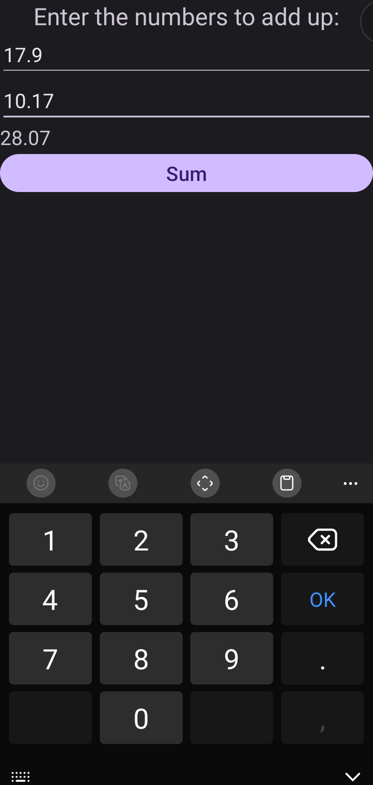

# AddTwoNum

Доработайте приложение для сложения двух чисел ( [ссылка на GitHub](https://github.com/ipetrushin/AddToNumK) )

```kotlin
// TODO: 1) реализовать проверку на пустые значения в полях numA, numB
// TODO: 2) исправить разметку, чтобы можно было вводить только числа
// TODO: 3) сделать поддержку вещественных (не целых чисел)
```

### [XML](app/src/main/res/layout/activity_main.xml)

### [Kotlin](app/src/main/java/com/example/addtwonum/MainActivity.kt)

### Example

<div style="text-align:center">
  
</div>
